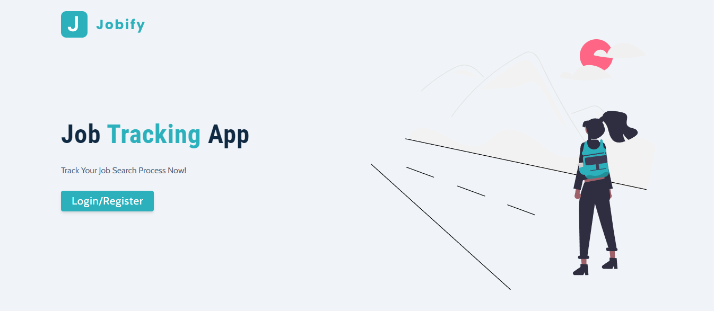

# Jobify


<div id="top"></div>


<!-- PROJECT LOGO -->
<div align="center">
<br>
<a href="#">
    
  </a>
<br>
<br>

  <p align="center">
  <a href="#">View Demo</a>
    ·
    <a href="https://github.com/abdrahmansoltan/jobify/issues">Report Bug</a>
  </p>
</div>

<!-- TABLE OF CONTENTS -->
<details>
  <summary>Table of Contents</summary>
  <ol>
    <li>
      <a href="#about-the-project">About The Project</a>
      <ul>
        <li><a href="#built-with">Built With</a></li>
      </ul>
    </li>
    <li>
      <a href="#getting-started">Getting Started</a>
      <ul>
        <li><a href="#installation">Installation</a></li>
        <li><a href="#ports">Ports</a></li>
      </ul>
    </li>
    <li><a href="#contributing">Contributing</a></li>
  </ol>
</details>

<!-- ABOUT THE PROJECT -->

## About The Project

MERN Stack Application for tracking Job Search Process



### Built With

- React
- React Router
- styled-components
- Node.js

<p align="right">(<a href="#top">back to top</a>)</p>

---

<!-- GETTING STARTED -->

## Getting Started

This project require some prequesites and dependenscies to be installed, you can find the instructions below

This project require some prequesites and dependenscies to be installed, you can view it online using this [demo](#). or you can find the instructions below:

> To get a local copy, follow these simple steps :

### Installation

#### installing Locally

1. Clone the repo
   ```sh
   git clone https://github.com/abdrahmansoltan/jobify.git
   ```
2. go to project folder

   ```sh
   cd jobify
   ```

<!-- 3. install dependenscies

   ```bash
   npm install
   ```

4. Run development server

   ```sh
   npm start
   ``` -->

### Ports

- FrontEnd Development Server runs on port `3000`

<p align="right">(<a href="#top">back to top</a>)</p>

---

<!-- CONTRIBUTING -->

## Contributing

Contributions are what make the open source community such an amazing place to learn, inspire, and create. Any contributions you make are **greatly appreciated**.

If you have a suggestion that would make this better, please fork the repo and create a pull request. You can also simply open an issue with the tag "enhancement".
Don't forget to give the project a star! Thanks again!

1. Fork the Project
2. Create your Feature Branch (`git checkout -b feature/AmazingFeature`)
3. Commit your Changes (`git commit -m 'Add some AmazingFeature'`)
4. Push to the Branch (`git push origin feature/AmazingFeature`)
5. Open a Pull Request

<p align="right">(<a href="#top">back to top</a>)</p>
